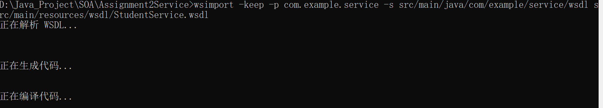
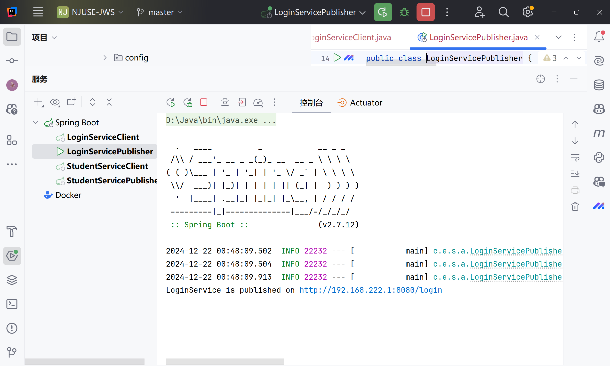
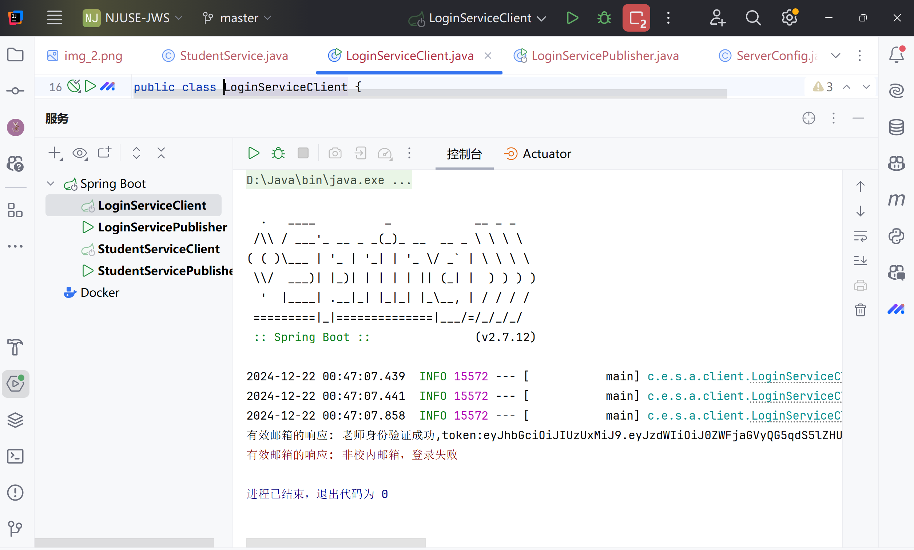
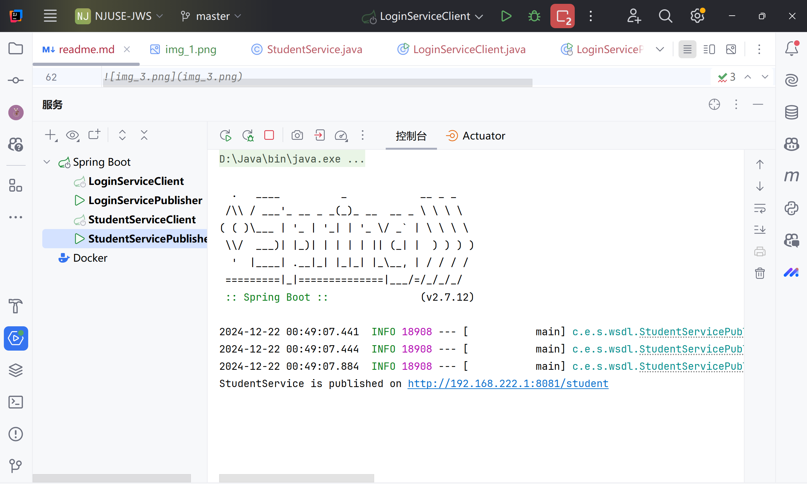
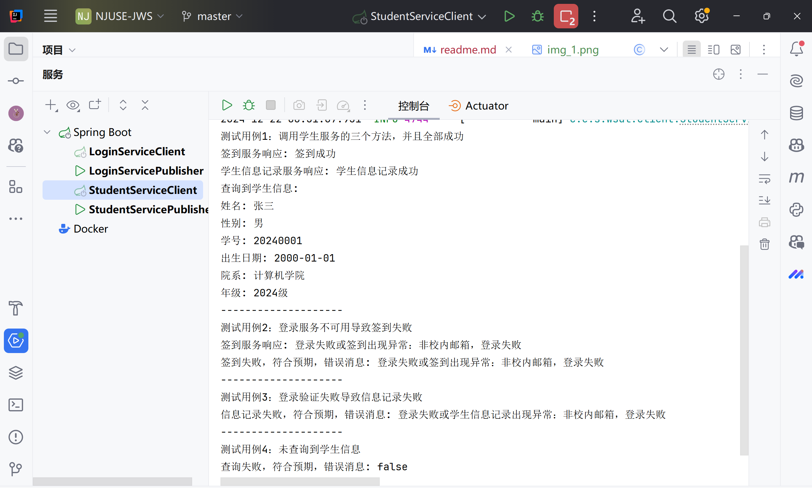

# 面向服务的软件工程作业二——Develop With JWS

## 作业要求
### 任务一
采用**Start from Java模式**，实现通过邮箱Login的功能
#### 要求：
1. 要求Login服务验证邮箱身份（老师、研究生、本科生）
2. 注意出错处理
3. 确保服务在学院内网的可访问性

### 任务二
编写WSDL描述服务：
1. 以校档案馆档案管理为业务背景，构建对学生个人信息实体进行操作的服务
2. 以上课签到为业务背景，构建学生签到的相关服务
#### 要求：
1. 采用**Start from WSDL模式**，实现上述服务 
2. 注意出错处理 
3. 确保服务在学院内网的可访问性 
4. 要求调用统一认证服务，其他业务逻辑随意…… 
5. 编写Client端，涵盖所有用例（注意错误对应用例）

## 环境配置
1. SDK使用的是Oracle OpenJDK version1.8.0_361，IDE使用的是IntelliJ IDEA 2021.1.1（Ultimate Edition），操作系统是Windows 10，maven版本是3.8.1
2. 使用maven进行项目管理，pom.xml文件中声明了如下的依赖： JAX-WS API 依赖，JAX-WS RI 依赖，JAX-WS Maven 插件，Spring Boot 启动器依赖等
3. 需要通过ipconfig查看本机在内网下的ip地址，然后在application.yml文件中配置服务的ip
4. **同时需要修改`StudentServiceImpl.java`中的LOGIN_SERVICE_URL为刚刚配置的ip，以及`StudentService.wsdl`中``` <service name="StudentService">
   <port name="StudentServicePort" binding="tns:StudentServiceBinding">
   <soap:address location="http://127.0.0.1:8081/student-service"/>
   </port>
   </service>```location的ip**
5. 当然也可以直接把所有的ip都改为localhost，然后直接运行即可，即可在本机上运行

## 实现过程
### 任务一
采用**Start from Java模式**，实现通过邮箱Login的统一认证登录功能：
1. 首先实现了一个**简单的LoginService.java接口**，包含一个login方法，用于验证邮箱身份
2. 实现了一个**LoginServiceImpl.java类**，实现了LoginService接口，用于验证邮箱身份（通过对邮箱的后缀进行判断，身份可以为老师、研究生、本科生）
3. 实现了一个**LoginServicePublisher.java类**，用于发布服务到**本机在内网ip下的8080端口**（在这之前需要配置application.yml文件，指定服务的ip和端口）
4. 实现了一个**LoginServiceClient.java类**，用于验证该服务是否能被正常客户端调用，包括了两种不同的情况，一种是验证成功，一种是验证失败

### 任务二
采用**Start from WSDL模式**，实现上述服务：
1. 首先编写了一个**StudentService.wsdl文件**，用于描述服务的接口，包含了两个方法，一个是签到，一个是保存和查询学生信息
2. 然后通过**wsimport命令**自动生成了对应的java文件，包括了`StudentService.java`，`StudentServiceImp.java`，`StudentServicePublisher.java`,生成的命令与环境如下：
   1. 首先根据https://blog.csdn.net/weixin_40550118/article/details/107510196 中的步骤，配置环境变量
   2. cd到项目根目录下，执行命令，生成对应的java文件，命令如下：
   3. ```wsimport -keep -p com.example.service.wsdl -s src/main/java/com/example/service/wsdl src/main/resources/wsdl/StudentService.wsdl```
   4. 执行结果：
3. 实现了**StudentServiceImpl.java类**，实现了StudentService接口，用于**实现签到和保存查询学生信息的功能**，并且都是**基于同一个统一认证服务进行验证**，也就是调用了LoginService服务
4. 实现了**StudentServicePublisher.java类**，用于发布服务到**本机在内网ip下的8081端口**（在这之前需要配置application.yml文件，指定服务的ip和端口）
5. 实现了**StudentServiceClient.java类**，用于验证该服务是否能被正常客户端调用，包括了所有可能的用例，**包括了正常的签到、查询学生信息、保存学生信息、查询学生信息失败等情况**

## 执行步骤与执行结果
### 任务一
1. 首先启动LoginServicePublisher.java，发布服务

2. 然后启动LoginServiceClient.java，调用服务，验证是否能够正常调用与错误处理，可以看到，当输入的邮箱为老师时，验证成功，当输入的邮箱为其他后缀（非nju.edu.cn）时，验证失败


### 任务二
1. 首先启动StudentServicePublisher.java，发布服务

2. 然后按照上面的步骤启动LoginServicePublisher.java，发布统一认证服务，这里就不再展示了
3. 然后启动StudentServiceClient.java，调用服务，验证是否能够正常调用与错误处理
